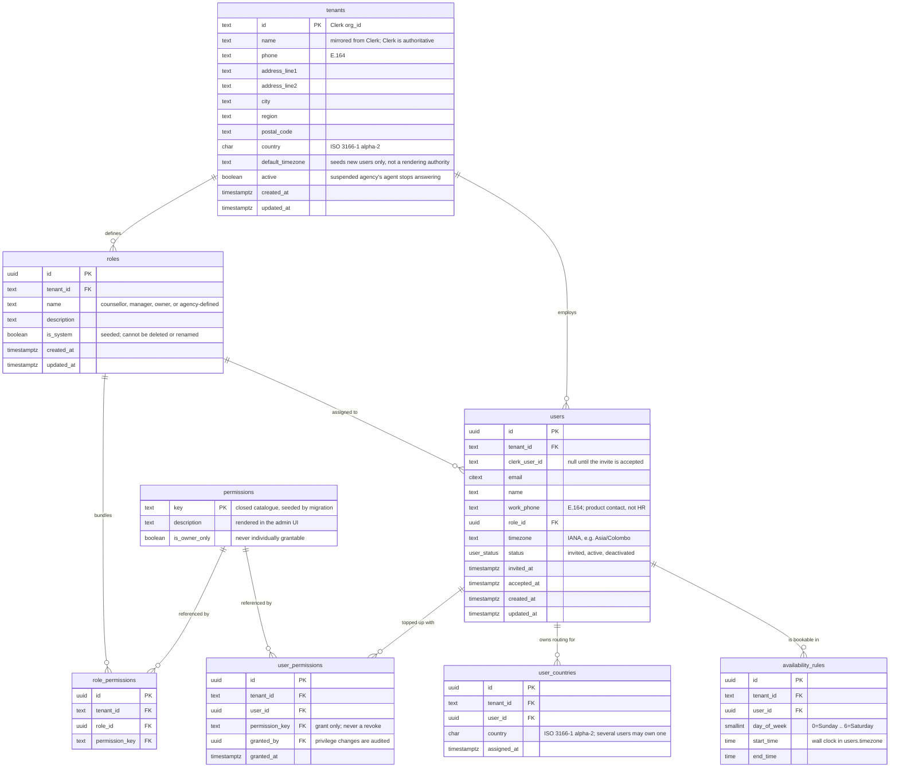

# Northbound — data model (1: people and access)

Who works at an agency, what they may do, and when they are reachable. Lead,
catalogue and audit tables come later.

Shared database, shared schema. Every table carries `tenant_id` — the Clerk
organization id, which is why it is `text` and not a uuid. Identity comes from
Clerk (who you are, which agencies you belong to); authorization comes from
these tables (what you may do inside one).

## The access model

A **role** is a named bundle of permissions, seeded per tenant. A **user** holds
exactly one role, and may additionally be granted individual permissions on top
of it — so a counsellor can be given catalogue editing without being promoted
to manager.

    effective permissions = role's permissions  ∪  the user's own grants

Grants only ever ADD. There is no revoke: a plain union is what keeps "why can
Priya do this?" answerable in one query. Someone who needs less gets a lower
role.

Permission keys come from a closed catalogue in code. Owners compose roles by
picking from it; they cannot invent a key, because a key nothing checks is a
setting that silently does nothing.

## The permission catalogue

Scope is expressed as a permission rather than hardcoded per role, so the
override mechanism covers visibility as well as capability.

| Key | Meaning |
|---|---|
| `leads.read.owned` | Leads in countries the user owns, plus the whole unassigned queue |
| `leads.read.all` | Every lead in the tenant, regardless of country |
| `leads.write` | Work a lead: notes, facts, status |
| `leads.assign` | Reassign a lead to another user |
| `catalogue.read` | Read programmes and requirements |
| `catalogue.flag` | Raise a correction against an entry; the only catalogue write a counsellor gets |
| `catalogue.write` | Create and edit programmes |
| `catalogue.verify` | Clear the verification queue — what lets an entry reach students again |
| `users.invite` | ⚠ owner-only, not individually grantable |
| `users.edit` | Edit a roster member |
| `users.countries.manage` | Set who owns which country |
| `roles.manage` | ⚠ owner-only, not individually grantable |
| `tenant.settings` | ⚠ owner-only. Confidence floor, default currency |

### Seeded roles

| | counsellor | manager | owner |
|---|---|---|---|
| `leads.read.owned` | ✓ | | |
| `leads.read.all` | | ✓ | ✓ |
| `leads.write` | ✓ | ✓ | ✓ |
| `leads.assign` | | ✓ | ✓ |
| `catalogue.read` | ✓ | ✓ | ✓ |
| `catalogue.flag` | ✓ | ✓ | ✓ |
| `catalogue.write` | | ✓ | ✓ |
| `catalogue.verify` | | ✓ | ✓ |
| `users.invite` | | | ✓ |
| `users.edit` | | ✓ | ✓ |
| `users.countries.manage` | | | ✓ |
| `roles.manage` | | | ✓ |
| `tenant.settings` | | | ✓ |

Priya as a counsellor granted `catalogue.write` is exactly the case this model
exists for: she edits programmes without gaining lead visibility, invites, or
tenant config.

## The unassigned queue is visible to everyone

A counsellor sees leads in their owned countries **plus every unassigned lead**,
including countries nobody owns. An escalated lead that no one can see is the
failure the escalation rules exist to prevent, so the queue is deliberately not
filtered by ownership.

## Constraints worth having from day one

- `unique (tenant_id, clerk_user_id)` and `unique (tenant_id, email)` — scoped
  to the tenant, because one person may work at two agencies and their email
  legitimately repeats across them.
- `unique (role_id, permission_key)` and `unique (user_id, permission_key)` — a
  permission granted twice is a bug.
- `unique (user_id, country)` — one ownership row per user per country.
- `check (end_time > start_time)` on availability.

## Rules no constraint can express

- **Every tenant keeps at least one owner.** The last one cannot be demoted,
  deactivated or removed, or the agency locks itself out permanently.
- **The agency creator is seeded as owner**, before any UI to grant it exists.
- **Owner-only keys are never individually grantable** — granting them
  piecemeal makes someone an owner by the back door.
- **Effective permissions resolve in one place.** One function, used by every
  endpoint. Two implementations will disagree eventually.

## Enforced by the database, not by discipline

- **A role in use cannot be deleted** — `users.role_id` is `ON DELETE RESTRICT`.
  (An earlier draft listed this as unenforceable. It is not.)
- **No cross-tenant reference is possible.** Every child references its parent
  on `(tenant_id, id)`, not on `id` alone, so a `user_countries` row cannot
  point at a user in another agency.
- **Owner-only permissions cannot be granted individually** — `user_permissions`
  pins `is_owner_only = false` and references `permissions(key, is_owner_only)`,
  so the composite key has nothing to match for an owner-only row.
- **An active user must be linked to Clerk** — `check (status <> 'active' or
  clerk_user_id is not null)`.

## Deliberately absent

No HR data — home address, personal phone, leave. HR is a different product;
if it lands it will be a `user_hr_profiles` table behind its own permission,
not columns here. No password or avatar: Clerk owns those, and mirroring
creates drift. No `role`
string alongside `role_id`, for the same reason. No `seniority` — routing by
experience is a routing rule over a profile field, not a permission.

There is no tenant timezone as a rendering authority — times render in the viewer's zone per
CLAUDE.md; a tenant default may seed a new user's `timezone`, nothing more.
