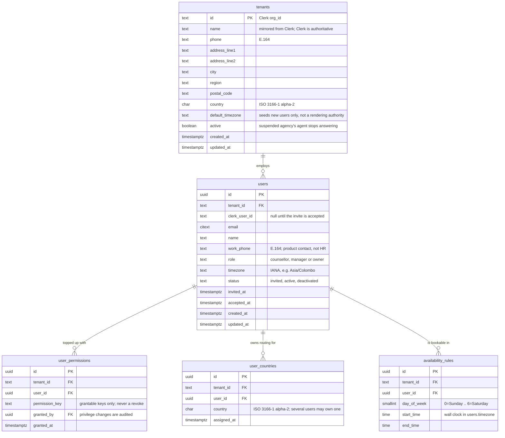

# Northbound — data model (1: people and access)

Who works at an agency, what they may do, and when they are reachable. Lead,
catalogue and audit tables come later.

Shared database, shared schema. Every table carries `tenant_id` — the Clerk
organization id, which is why it is `text` and not a uuid. Identity comes from
Clerk (who you are, which agencies you belong to); authorization comes from
here (what you may do inside one).

Migrations: `001` created the people-and-access tables; `002` replaced
tenant-owned role rows with an enum and moved the permission catalogue into
`student_agent/permissions.py`.

## The access model

A **role** is one of three fixed values on `users`. A user may additionally be
granted individual permissions on top of it — so a counsellor can be given
catalogue editing without being promoted to manager and inheriting every lead
in the agency.

    effective permissions = ROLE_PERMISSIONS[user.role]  ∪  the user's grants

Grants only ever ADD. There is no revoke: a plain union is what keeps "why can
Priya do this?" answerable in one query. Someone who needs less gets a lower
role.

The catalogue lives in code rather than a table because a permission only
means something if a code path checks it — a key nobody checks is a setting
that silently does nothing. `permissions.py` is the single place permissions
resolve; the `user_permissions` CHECK constraint is the same rule stated at
the boundary, and a test asserts the two have not drifted.

Creating an agency costs **2 rows**: one `tenants`, one `users` as owner.

## The permission catalogue

Defined in `student_agent/permissions.py`. Scope is a permission rather than
something hardcoded per role, so the grant mechanism covers visibility as well
as capability.

| Key | counsellor | manager | owner | Grantable |
|---|:--:|:--:|:--:|:--:|
| `leads.read.owned` | ✓ | | | ✓ |
| `leads.read.all` | | ✓ | ✓ | ✓ |
| `leads.write` | ✓ | ✓ | ✓ | ✓ |
| `leads.assign` | | ✓ | ✓ | ✓ |
| `catalogue.read` | ✓ | ✓ | ✓ | ✓ |
| `catalogue.flag` | ✓ | ✓ | ✓ | ✓ |
| `catalogue.write` | | ✓ | ✓ | ✓ |
| `catalogue.verify` | | ✓ | ✓ | ✓ |
| `users.edit` | | ✓ | ✓ | ✓ |
| `users.invite` | | | ✓ | — |
| `users.countries.manage` | | | ✓ | — |
| `tenant.settings` | | | ✓ | — |

The last three are owner-only and absent from the `user_permissions` CHECK, so
they cannot be granted individually — that would make someone an owner by the
back door.

Priya as a counsellor granted `catalogue.write` is the case this model exists
for: she edits programmes without gaining lead visibility, invites or tenant
config.

## The unassigned queue is visible to everyone

A counsellor sees leads in their owned countries **plus every unassigned lead**,
including countries nobody owns. An escalated lead that no one can see is the
failure the escalation rules exist to prevent, so the queue is deliberately not
filtered by ownership.

## Constraints

- `unique (tenant_id, clerk_user_id)` and `unique (tenant_id, email)` — scoped
  to the tenant, because one person may work at two agencies and their email
  legitimately repeats across them.
- `unique (user_id, permission_key)` — a permission granted twice is a bug.
- `unique (user_id, country)` — one ownership row per user per country.
- `check (end_time > start_time)` and `check (day_of_week between 0 and 6)`.

## Enforced by the database, not by discipline

- **No cross-tenant reference is possible.** Every child references its parent
  on `(tenant_id, id)`, not on `id` alone, so a `user_countries` row cannot
  point at a user in another agency.
- **Owner-only permissions cannot be granted individually** — the
  `user_permissions` CHECK does not list them.
- **An invented permission key is refused** by the same CHECK.
- **`role` is one of three values**, CHECKed rather than free text.
- **An active user must be linked to Clerk** — `check (status <> 'active' or
  clerk_user_id is not null)`.

## Rules no constraint can express

- **Every tenant keeps at least one owner.** The last one cannot be demoted,
  deactivated or removed, or the agency locks itself out permanently.
- **The agency creator is seeded as owner**, before any UI to grant it exists.
- **Effective permissions resolve in one place** — `permissions.py`. Two
  implementations would disagree eventually.

## Deliberately absent

No HR data — home address, personal phone, leave. HR is a different product;
if it lands it will be a `user_hr_profiles` table behind its own permission,
not columns here. No password or avatar: Clerk owns those, and mirroring
creates drift.

Agencies cannot define roles of their own. That was built and then removed in
`002` — it cost four tables and 30 rows per signup to serve a need no customer
has yet stated. It comes back as a migration if one does.

There is no tenant timezone as a rendering authority — times render in the
viewer's zone per CLAUDE.md; `default_timezone` seeds a new user's `timezone`
and nothing more.
