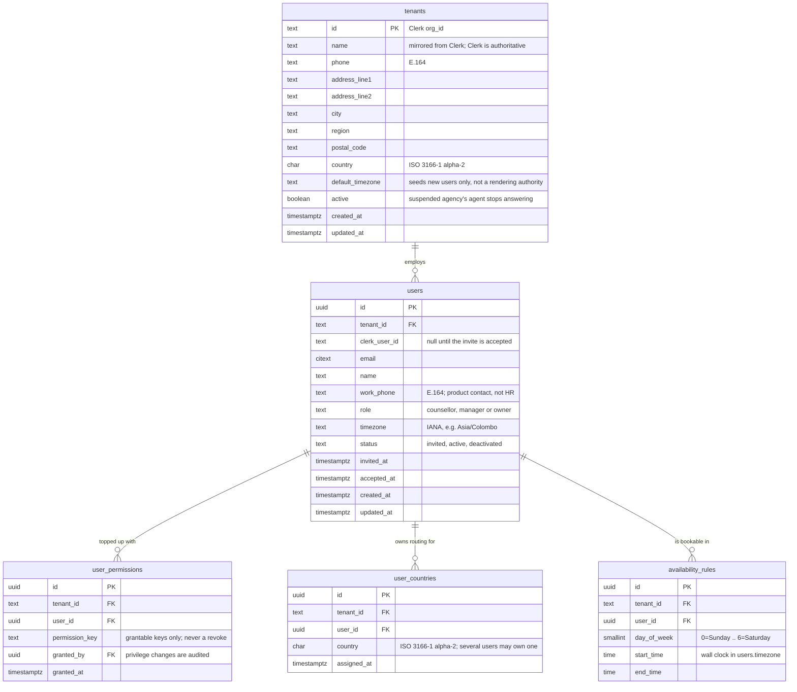
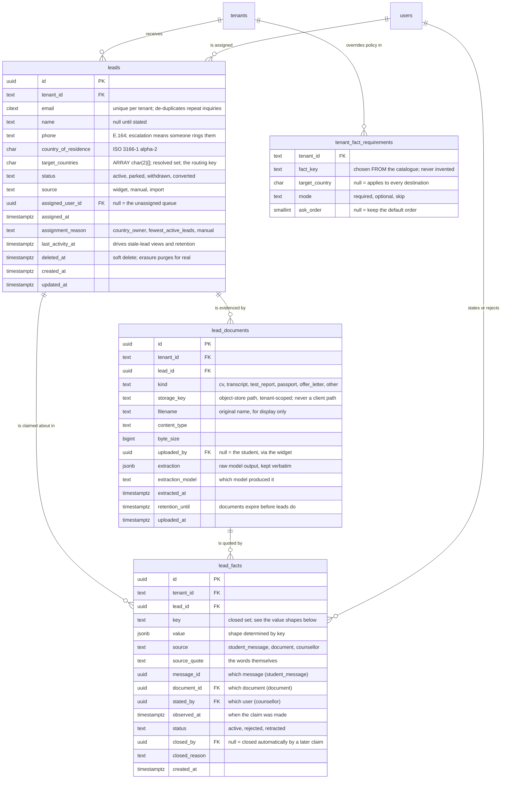

# Northbound — data model (1: people and access)

> Part 1 — people and access (below) · [Part 2 — leads and facts](#northbound--data-model-2-leads-and-facts)

Who works at an agency, what they may do, and when they are reachable. The
lead record is part 2; catalogue and audit tables come later.

Shared database, shared schema. Every table carries `tenant_id` — the Clerk
organization id, which is why it is `text` and not a uuid. Identity comes from
Clerk (who you are, which agencies you belong to); authorization comes from
here (what you may do inside one).

Migrations: `001` created the people-and-access tables; `002` replaced
tenant-owned role rows with an enum and moved the permission catalogue into
`student_agent/permissions.py`.

## The access model

A **role** is one of three fixed values on `users`. A user may additionally be
granted individual permissions on top of it — so a counsellor can be given
catalogue editing without being promoted to manager and inheriting every lead
in the agency.

    effective permissions = ROLE_PERMISSIONS[user.role]  ∪  the user's grants

Grants only ever ADD. There is no revoke: a plain union is what keeps "why can
Priya do this?" answerable in one query. Someone who needs less gets a lower
role.

The catalogue lives in code rather than a table because a permission only
means something if a code path checks it — a key nobody checks is a setting
that silently does nothing. `permissions.py` is the single place permissions
resolve; the `user_permissions` CHECK constraint is the same rule stated at
the boundary, and a test asserts the two have not drifted.

Creating an agency costs **2 rows**: one `tenants`, one `users` as owner.

## The permission catalogue

Defined in `student_agent/permissions.py`. Scope is a permission rather than
something hardcoded per role, so the grant mechanism covers visibility as well
as capability.

| Key | counsellor | manager | owner | Grantable |
|---|:--:|:--:|:--:|:--:|
| `leads.read.owned` | ✓ | | | ✓ |
| `leads.read.all` | | ✓ | ✓ | ✓ |
| `leads.write` | ✓ | ✓ | ✓ | ✓ |
| `leads.assign` | | ✓ | ✓ | ✓ |
| `catalogue.read` | ✓ | ✓ | ✓ | ✓ |
| `catalogue.flag` | ✓ | ✓ | ✓ | ✓ |
| `catalogue.write` | | ✓ | ✓ | ✓ |
| `catalogue.verify` | | ✓ | ✓ | ✓ |
| `users.edit` | | ✓ | ✓ | ✓ |
| `users.invite` | | | ✓ | — |
| `users.countries.manage` | | ✓ | ✓ | — |
| `tenant.settings` | | | ✓ | — |

The last column is a separate question from the first three. `users.invite`,
`users.countries.manage` and `tenant.settings` are absent from the
`user_permissions` CHECK and so cannot be granted individually — handing them
out one at a time is how someone is promoted by the back door.

But not grantable does not mean owner-only. A manager holds
`users.countries.manage` by role: moving a country when a counsellor goes on
leave is day-to-day team management, not a tenant-wide setting. The flag in
`permissions.py` is therefore named `grantable`, after what it actually
enforces.

Priya as a counsellor granted `catalogue.write` is the case this model exists
for: she edits programmes without gaining lead visibility, invites or tenant
config.

## The unassigned queue is visible to everyone

A counsellor sees leads in their owned countries **plus every unassigned lead**,
including countries nobody owns. An escalated lead that no one can see is the
failure the escalation rules exist to prevent, so the queue is deliberately not
filtered by ownership.

## Constraints

- `unique (tenant_id, clerk_user_id)` and `unique (tenant_id, email)` — scoped
  to the tenant, because one person may work at two agencies and their email
  legitimately repeats across them.
- `unique (user_id, permission_key)` — a permission granted twice is a bug.
- `unique (user_id, country)` — one ownership row per user per country.
- `check (end_time > start_time)` and `check (day_of_week between 0 and 6)`.

## Enforced by the database, not by discipline

- **No cross-tenant reference is possible.** Every child references its parent
  on `(tenant_id, id)`, not on `id` alone, so a `user_countries` row cannot
  point at a user in another agency.
- **Owner-only permissions cannot be granted individually** — the
  `user_permissions` CHECK does not list them.
- **An invented permission key is refused** by the same CHECK.
- **`role` is one of three values**, CHECKed rather than free text.
- **An active user must be linked to Clerk** — `check (status <> 'active' or
  clerk_user_id is not null)`.

## Rules no constraint can express

- **Every tenant keeps at least one owner.** The last one cannot be demoted,
  deactivated or removed, or the agency locks itself out permanently.
- **The agency creator is seeded as owner**, before any UI to grant it exists.
- **Effective permissions resolve in one place** — `permissions.py`. Two
  implementations would disagree eventually.

## Deliberately absent

No HR data — home address, personal phone, leave. HR is a different product;
if it lands it will be a `user_hr_profiles` table behind its own permission,
not columns here. No password or avatar: Clerk owns those, and mirroring
creates drift.

Agencies cannot define roles of their own. That was built and then removed in
`002` — it cost four tables and 30 rows per signup to serve a need no customer
has yet stated. It comes back as a migration if one does.

There is no tenant timezone as a rendering authority — times render in the
viewer's zone per CLAUDE.md; `default_timezone` seeds a new user's `timezone`
and nothing more.

---

# Northbound — data model (2: leads and facts)

The student, what we have been told about them, and the documents that back it
up. Conversation, notes, escalations, follow-ups and slots come in `004`;
programmes and requirements are their own slice.

Migration `003` creates `leads`, `lead_facts`, `lead_documents` and
`tenant_fact_requirements`.

## One idea underneath all of it

`lead_facts` is **a log of claims, not a row of answers.**

Several rows for the same `key` is the normal case, not a conflict to clean up.
A student says their GPA is 3.4; two days later their transcript says 3.38.
Both are true statements about what we were told, they were told to us by
different sources with different authority, and neither should overwrite the
other. "What is this student's GPA?" is answered by a **rule over the log**,
not by reading a column.

This is what makes the product's central promise cheap to keep: *facts are
quoted, never inferred*, and every value on screen can be traced back to the
words it came from.

## Fact keys and their value shapes

The key set is closed and lives in `student_agent/agent/facts.py`. A CHECK
constraint states the same list at the database boundary.

| Key | Value shape |
|---|---|
| `target_country` | `{"country": "GB", "preference": 1}` — or `{"status": "undecided"}` |
| `field_of_study` | `{"field": "data science"}` |
| `qualification` | `{"level": "bachelor", "years": 3, "subject": "...", "institution": "...", "country": "IN"}` |
| `grades` | `{"system": "percentage", "value": 72, "scale": 100, "country": "IN"}` |
| `english_test` | `{"test": "IELTS", "overall": 6.5, "listening": 7.0, "reading": 6.5, "writing": 6.0, "speaking": 6.5, "taken_on": "2025-03-14"}` |
| `budget_per_year` | `{"amount": 2500000, "currency": "GBP"}` — minor units |
| `intended_intake` | `{"year": 2027, "month": 9}` |

Three of these are structured because the flat version cannot answer a real
entry requirement:

- **`english_test`** — a UK masters asks for *"6.5 overall with no band below
  6.0"*. `"IELTS 6.5"` cannot answer that. The seed data proves the point: the
  quote *"IELTS 6.5 overall, 6.0 in writing"* was stored as `"IELTS 6.5"`, so
  the student's own words carried a band score the schema then discarded.
- **`qualification`** — `Requirement.rule` is machine text like
  `bachelor_years>=4`. With the value as prose, evaluating it means parsing
  English with an LLM on every check. `years: 3` makes it arithmetic. This is
  the single most common eligibility question in South Asia → UK/Australia
  consulting.
- **`grades`** — `72` is meaningless without its system. An Indian 72%, a
  Chinese 85/100 and a US 3.4/4.0 are not comparable numbers, and one seed row
  (*"my GPA converts to about 88%"*) shows a student's own approximate
  conversion stored as a hard fact.

### Two keys hold a set, not a value

A student may want several countries, and several fields. `target_country` and
`field_of_study` therefore resolve to a SET, and each member is **its own
claim with its own quote**.

    key = target_country   value = {"country": "GB", "preference": 1}
                           quote = "I want to do my masters in the UK"

    key = target_country   value = {"country": "AU", "preference": 2}
                           quote = "actually i'm also looking at australia"

One row holding `["GB", "AU"]` is not possible without breaking the quote rule:
those two countries were named in two different messages, so no single quote
covers both, and writing one would mean inventing words the student never said.

`preference` is what the student stated, not a guess — a seed row says
*"Australia is my first choice"*. It is null when they did not rank them.

The same applies to `field_of_study`, and the seed data already shows the loss:
the quote *"something in data science or analytics"* was stored as
`"data science"`, so half of the student's answer disappeared.

A negative answer is a fact, not an absence: *"I haven't sat IELTS, booked for
November"* is `{"test": "IELTS", "status": "not_taken", "planned_for":
"2026-11"}`. It is actionable — it becomes a `test_result` follow-up — where a
null would be silence.

Value shapes are validated in code on write. The database CHECKs the key, not
the shape; a jsonb schema constraint would duplicate the Pydantic models and
the two would drift.

## Which claim wins

Resolved on read, by rule, never by overwrite. **The rule depends on whether
the key holds one value or a set.**

Scalar keys — `grades`, `english_test`, `qualification`, `budget_per_year`,
`intended_intake` — pick exactly one active claim:

    1. counsellor            a human checked the original
    2. official document     transcript, test_report, passport
    3. self-reported         a chat message, or a CV
    4. within a tier         most recent observed_at

Set-valued keys — `target_country`, `field_of_study` — take the **union** of
active claims, ordered by `preference` then `observed_at`.

Applying "most recent wins" to a set would be a data-loss bug: a student adding
Australia on Tuesday would silently lose the UK they asked for on Monday.

**A CV is not an official document.** The student wrote it, so it sits in the
self-reported tier alongside chat. That distinction is why trust derives from
`lead_documents.kind` rather than from `lead_facts.source` alone.

Neither a rejected nor a retracted claim resolves, and the difference
between them matters to whoever reads the history:

| status | meaning |
|---|---|
| `active` | stands |
| `rejected` | never valid evidence — *"this transcript is a different person"* |
| `retracted` | was true, no longer applies — *"I've decided against Canada"* |

`closed_by` is nullable, and null means *no human did this*. A student who
says they are undecided and then names a country has retracted the first claim
themselves; the retraction follows from the second claim, and requiring a user
id there would mean inventing a system account to satisfy a foreign key.

Only `rejected` casts doubt on the source. A student changing their mind is not
an error, and recording it as one would misread the lead's history. Both stay
visible, so nobody re-uploads the same document next month wondering where the
value went.

### Conflicts escalate; they do not resolve quietly

When two active claims for one key disagree materially and none is
counsellor-sourced, the key is **in conflict** and the lead escalates.

A CV claiming IELTS 7.0 against a test report saying 6.0 is not a tie for a
rule to break — it decides whether the student is eligible at all. Silently
preferring the document would also silently stop the agent telling that student
they qualify, with nobody informed. Same principle as `indeterminate`: the
system must be able to say *"we do not know"* out loud.

## What the agent is asked, and by whom

The checklist is **computed, never stored**:

    to_ask(lead) = required_for(tenant_id, lead) − keys_with_active_claims(lead)

`required_for()` resolves in two layers:

    1. the DEFAULT policy, in agent/facts.py — one copy for everybody
    2. overlaid with this tenant's rows in tenant_fact_requirements

Both layers select rows where `target_country` is null, plus rows matching
**any** country in this lead's resolved set. A student aiming at Germany and
the UK needs the German-language requirement and IELTS both; a key matched
twice is asked once.

The result is rendered into `<lead_facts>` and prepended to the student's
message on every turn (`agent/core.py::prepend_context`). **The agent never
queries for this.** The set difference happens in Python before the model runs,
and the model is handed the answer as text.

### The table holds overrides only

`tenant_fact_requirements` is empty for an agency that is happy with the
defaults, and creating an agency writes **no rows** into it.

Copying the default policy into every tenant at signup would work and would
also freeze it. Deciding a year later that `budget_per_year` should be optional
for everyone would then mean rewriting a hundred copies while trying to guess
which rows an agency had deliberately changed. Keeping the defaults in one
place makes that a one-line edit.

It also makes the table readable: three rows across a hundred agencies say
exactly what those three agencies do differently, where nine hundred rows bury
the same information under copies.

This is the shape of decision `002` already made — per-tenant `roles` and
`role_permissions` cost 30 rows a signup and became a code constant in
`permissions.py`.

`mode` is three-valued rather than a boolean because *"ask, but never block"*
and *"do not ask at all"* are both real settings, and `required = false` can
only express one of them.

A tenant chooses **which** keys are required. A tenant cannot **invent** keys —
`fact_key` is CHECKed against the same closed set, for the reason permissions
are: a key no code path evaluates is a question asked of a student for nothing.
Adding a key is a code change (value model, requirement evaluator, migration).
Letting agencies define their own is sketched under **Deliberately absent**.

## What reads and writes this

Not only the agent. Every table here has a human path too.

| Operation | Actor | Permission |
|---|---|---|
| Create a lead | widget (public), or a counsellor | — / `leads.write` |
| Read a lead + resolved facts | counsellor | `leads.read.owned` / `.all` |
| Read every claim, with sources | counsellor | `leads.read.owned` / `.all` |
| Write a fact from a chat message | agent | tool boundary |
| Write a fact from a phone call | counsellor | `leads.write` |
| Reject a claim | counsellor | `leads.write` |
| Upload a document | student (widget) or counsellor | — / `leads.write` |
| Re-run extraction on a document | counsellor | `leads.write` |
| Reassign a lead | manager | `leads.assign` |
| Edit the required-fact policy | owner | `tenant.settings` |

The agent and the counsellor write to the same table through the same
constraints. The only difference is which arm of the source CHECK they satisfy.

## Enforced by the database, not by discipline

- **A fact cannot exist without its evidence.** The source CHECK has three
  arms: `student_message` requires `source_quote` and `message_id`, `document`
  requires `source_quote` and `document_id`, `counsellor` requires `stated_by`.
  The anti-inference rule moves out of Pydantic and into the schema, where the
  CV extractor is bound by it too.
- **No cross-tenant reference is possible.** Children reference
  `(tenant_id, id)`, so a fact cannot cite another agency's document.
- **A deactivated counsellor's leads return to the queue** —
  `on delete set null (assigned_user_id)`. The column list is required: a bare
  `SET NULL` on a composite key nulls `tenant_id` too, which is NOT NULL.
- **Invented fact keys are refused**, in `lead_facts` and in
  `tenant_fact_requirements` — both CHECK the same closed set.
- **A closed claim names who closed it** — rejected and retracted alike.

## Rules no constraint can express

- **Value shapes match their key.** Validated in code, on both write paths.
- **`leads.target_countries` is a cache** of the resolved `target_country`
  set, maintained when those claims change. Nothing else may write it.
- **Set-valued keys union; scalar keys pick one.** Applying the scalar rule to
  a set silently drops destinations the student asked for.
- **Grades resolve across incompatible systems.** A lead may hold
  `percentage 72/100` from a chat message and `cgpa 6.8/10` from a transcript.
  The rule picks the transcript, but comparing either against a UK 2:1 needs a
  conversion table — a service that does not exist yet, and the kind of thing
  that gets hardcoded badly if nobody names it first.
- **Conflicting keys escalate** rather than resolving silently.
- **Extraction writes only catalogue keys.** Whatever else the model found
  stays in `lead_documents.extraction` and reaches no fact row.

## Routing

Routing uses `target_country`, not `country_of_residence` — agencies specialise
by destination ("the Australia desk").

A lead may target several countries, and different users may own each of them,
so the choice between candidates is stated here in full. CLAUDE.md requires it
be recorded rather than improvised, and this is that record:

    1. the user owning the student's HIGHEST-PREFERENCE target country
    2. if no preference was stated, any user owning ANY target country
    3. among candidates, fewest active leads
    4. ties broken by lowest user id
    5. no owner for any target country → the unassigned queue

Step 1 exists because a student who says *"Australia is my first choice"* has
told us where they want to be handled, and overriding that for load balance
would be the system knowing better than the person. Step 2 is what keeps the
rule total when they did not rank anything.

`leads.target_countries` is a `char(2)[]` cache of the resolved set, maintained
whenever a `target_country` claim changes, so the routing query stays a single
indexed table scan rather than a join into the claim log.

### A lead with no destination

*"I want to study abroad but I don't know where"* is a common and valuable
case — those students need the agency's advice most.

It is recorded as a claim, `{"status": "undecided"}`, with the student's own
words. Not as an absent row: without it `required_for()` keeps returning
`target_country` and the agent asks the same question every turn, having
already been answered.

Such a lead has no country to route on and joins the **unassigned queue**,
which every counsellor can see. That is the existing rule doing its job, not a
gap in it.

The agent's next move is to ask the OTHER facts. Budget, qualification, field
and intake narrow the field on their own — a student with £10,000 a year, a
three-year bachelor and no English test has few realistic destinations.

The agent may **not** name candidate countries from its own knowledge. That is
a fact, and tools are the only source of facts. Narrowing the choice needs a
catalogue-backed tool that returns countries with programmes actually matching
those facts; it belongs to the catalogue slice and does not exist yet.

When the student then chooses, that is an ordinary claim with a real quote, and
the `undecided` row is **retracted** — true when stated, no longer true. The
history then shows both that they started undecided and how they arrived.

## Deliberately absent

**No `escalated` status.** Lifecycle (`active`, `parked`, `withdrawn`,
`converted`) and "needs a human" are orthogonal — an escalated lead is still
active, and collapsing them loses what the lead was before it escalated and
whether a conversion followed one. Escalation is an unresolved row in
`escalations` (`004`), so there is one source of truth rather than a column two
code paths must keep in step.

**No `superseded_at` on facts.** With several live sources, "superseded" is the
wrong word: a transcript does not cancel the student's statement, it outranks
it. If that transcript is later rejected, the student's claim should stand
again on its own — a rule does that, a flag would need un-setting.

**No fact history table.** The log *is* the history.

**No list packed into one claim.** `target_country` as `["GB", "AU"]` in a
single row would need a `source_quote` covering both countries, which the
student never uttered in one message. One row per country keeps every value
attached to the words that produced it.

**No agency-defined fact keys — yet.** The key set is closed and a tenant
picks from it. An agency wanting a new fact needs five things it cannot supply
from a settings form: the key, a value shape, an evaluator, an extractor rule
and a widened CHECK. A description alone tells the model what a fact MEANS but
tells the code nothing about what it LOOKS like, so the same answer lands as
`320`, `"320"`, `"320/340"` and `"good"` on different days and every comparison
against it becomes unreliable.

The safe version, when it lands, is a `tenant_fact_definitions` table where the
agency supplies a description AND a declared type — number with bounds, text,
boolean, or one-of-a-list. The description steers the agent; the type lets the
code validate and compare. Facts carrying real domain logic — `grades`,
`english_test`, `qualification` — stay built in, because they are rules rather
than comparisons.

The cost is stated here so it is not a surprise: with tenant-defined keys the
database can no longer CHECK the vocabulary, and that validation moves into
code.

**No passport number column.** Store that the passport was seen, not what it
says. It is high-value for identity fraud and buys nothing operationally.

**No pre-seeded null rows.** A row here means *someone claimed something, and
here is the evidence*. A placeholder has no source, no quote and no timestamp,
so allowing one means making every provenance column nullable — dropping the
guarantee in order to store rows that carry no information. "Not yet asked" is
the absence of a row, which is what absence honestly means.
